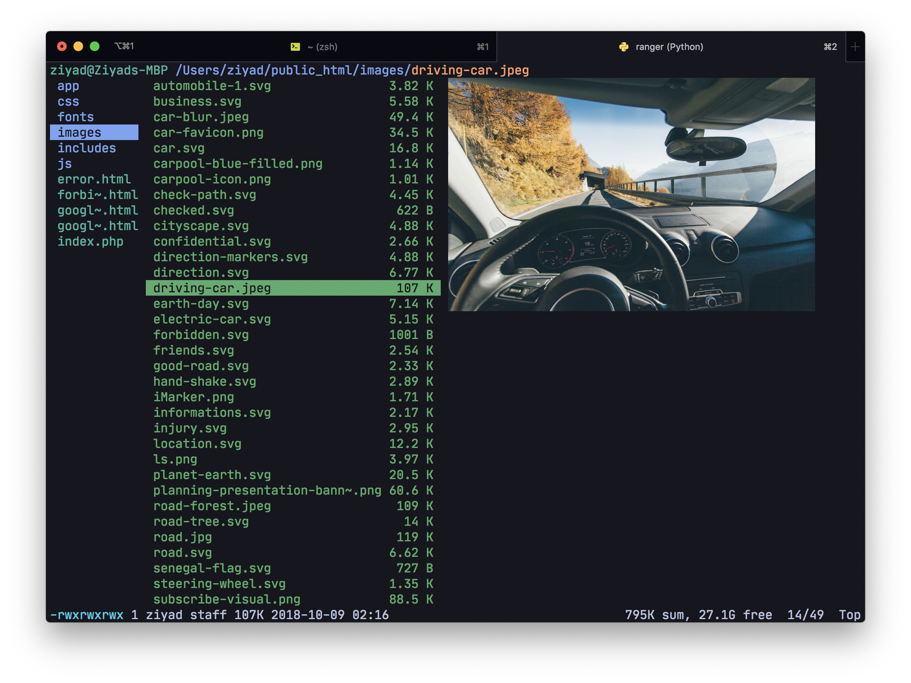
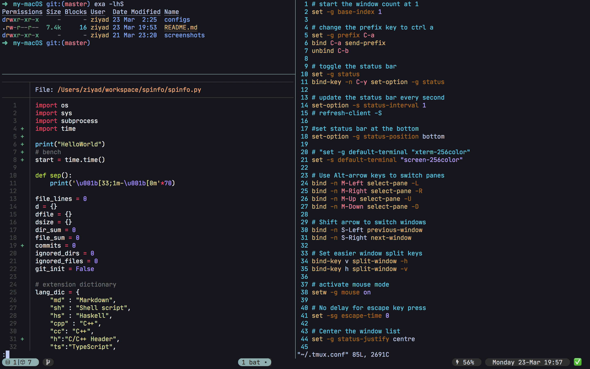
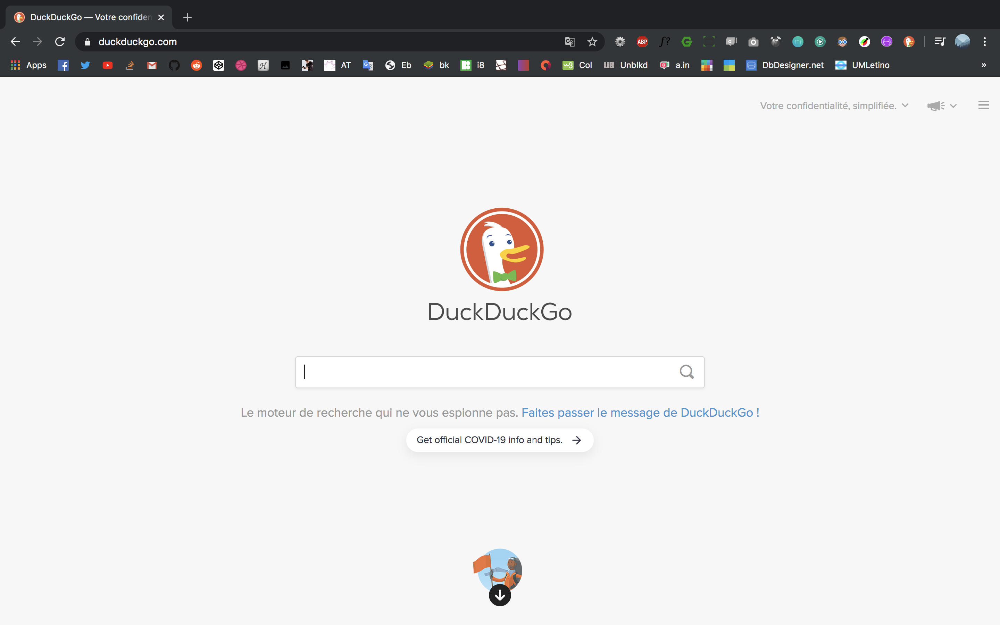
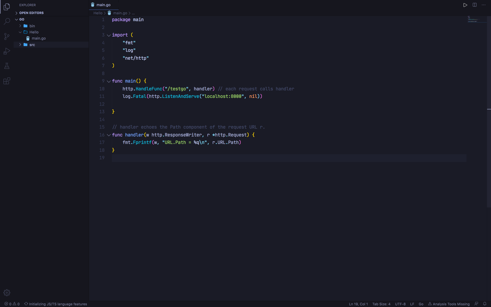
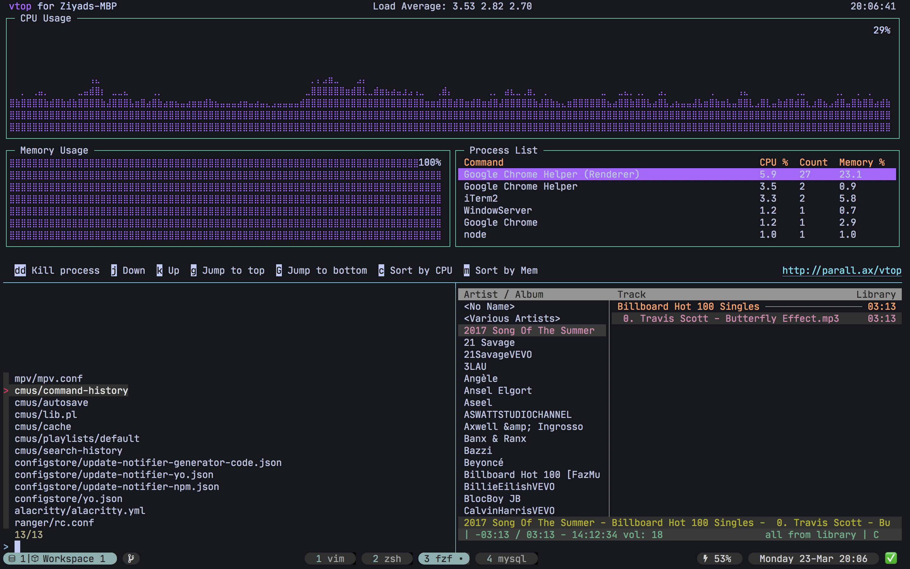
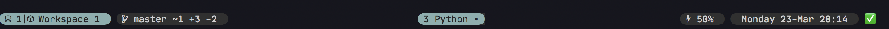

# my macOS
> my personal macOS experience 
## Table of contents
- ### [Browsers](#browser)
	- [Google chrome](#google-chrome)
	- [Firefox](#firefox)
- ### [Dev](#developer)
	- [Monospace fonts](#monospace-fonts)
	- [Terminal emulators](#terminals)
	- [Command line programs](#command-line-programs)
	- [Programming languages](#programming-languages)
	- [Text editors](#text-editor)
- #### [Wallpapers](#walls)
- #### [Graphical mac apps](#gui-apps)
- #### [Configuration files](#links)

## Screenshots
#### Ranger

#### bat, vim and exa 

#### chrome browser

#### vscode 

#### vtop, cmus and fzf

#### tmux minimal status bar 

## Browsers
<a name="google-chrome">
- ### [Google chrome](https://www.google.com/chrome/?/brand=CHBD&gclid=Cj0KCQjw9tbzBRDVARIsAMBplx9jDdkZRRFwzqaQwucGThj3OJTJK77Jv3Er3FoSwQlpgvffj4p4XwAaAlHjEALw_wcB&gclsrc=aw.ds)
	- [Extensions]()
	 

	| name | description |
	-----------|------------
	| [Dark Reader](https://chrome.google.com/webstore/detail/dark-reader/eimadpbcbfnmbkopoojfekhnkhdbieeh) | Dark mode for all websites
	| [momentum](https://chrome.google.com/webstore/detail/momentum/laookkfknpbbblfpciffpaejjkokdgca) | Replace new tab page with a personal dashboard featuring to-do, weather, and inspiration.
	| [Full Page Screen Capture](https://chrome.google.com/webstore/detail/full-page-screen-capture/fdpohaocaechififmbbbbbknoalclacl) | Capture a screenshot of your current page in entirety and reliably
	| [JSON Viewer Awesome](https://chrome.google.com/webstore/detail/json-viewer-awesome/iemadiahhbebdklepanmkjenfdebfpfe) | makes a better JSON viewing
	| [Adblock Plus](https://chrome.google.com/webstore/detail/adblock-plus-free-ad-bloc/cfhdojbkjhnklbpkdaibdccddilifddb) | ad blocker
	| [Ratings Preview for YouTube™](https://chrome.google.com/webstore/detail/ratings-preview-for-youtu/piaphheklodiededmbmgfcfbcagncgka) | see the rating on youtube before clicking on a video
	|[Visbug](https://chrome.google.com/webstore/detail/visbug/cdockenadnadldjbbgcallicgledbeoc) | Helps with the developer experience
	|[Wappalyzer](https://chrome.google.com/webstore/detail/wappalyzer/gppongmhjkpfnbhagpmjfkannfbllamg) | identify web technologies
	|[Window Resizer](https://chrome.google.com/webstore/detail/window-resizer/kkelicaakdanhinjdeammmilcgefonfh) | window resizer 
	|[WhatFont](https://chrome.google.com/webstore/detail/whatfont/jabopobgcpjmedljpbcaablpmlmfcogm) | identify fonts on a web page

	- [Theme]() 
		- [Material Incognito Dark Theme](https://chrome.google.com/webstore/detail/material-incognito-dark-t/ahifcnpnjgbadkjdhagpfjfkmlapfoel?hl=en)

- #### [Firefox](https://www.mozilla.org/en-US/firefox/)

## Dev

### [Monospace fonts]()

- [Jetbrains mono](https://www.jetbrains.com/lp/mono/)
	* [Nerdfont version](https://www.nerdfonts.com/) (for extra glyphs for tmux)
- [SF mono](https://developer.apple.com/fonts/)
- [Fira Code](https://github.com/tonsky/FiraCode)

### Terminal emulators

- [iterm2](https://www.iterm2.com/)
- [alacritty](https://github.com/alacritty/alacritty)
- [Shells]()
	- bash
	- [zsh](https://www.zsh.org/)
		- theme : [robbyrussel](https://github.com/ohmyzsh/ohmyzsh/wiki/Themes#robbyrussell)
	  - plugins : [git]() & [zsh-autocompletion]()

### Commnad line programs

name | description 
-------| ---------
[exa](https://github.com/ogham/exa) | a modern  'ls'  alternative
[bat](https://github.com/sharkdp/bat) | a modern  'cat'  alternative
[git](https://git-scm.com/) | version control system
[oh-my-zsh](https://github.com/ohmyzsh/ohmyzsh) | a framework the for the zsh shell
[fzf](https://github.com/junegunn/fzf)| fuzzy file finder
[ranger](https://github.com/ranger/ranger) | command line file manager
[tmux](https://github.com/tmux/tmux) | terminal multiplexer
[mpv](https://github.com/tmux/tmux) | video player
[vtop](https://github.com/MrRio/vtop)| activity montitor
[VIM](https://www.vim.org/download.php) | The text editor

### Programing languages:

- [Node (Javascript)](https://nodejs.org/en/)
- [Go](https://golang.org/)
- [python](https://www.python.org/)
- [Dart](https://dart.dev/)

[Package managers]()

- [npm]() (comes with node)
- [pip](https://pip.pypa.io/en/stable/installing/)

### Text editors

- [VScode](https://code.visualstudio.com/)
	- [Extensions]()

	| name  | description|
	|-------|------------
	| [Bracket pair colorizer](https://marketplace.visualstudio.com/items?itemName=CoenraadS.bracket-pair-colorizer) | colorize matching brackets
	| [ESlint](https://marketplace.visualstudio.com/items?itemName=dbaeumer.vscode-eslint) | JS linter
	| [Github markdown preview](https://marketplace.visualstudio.com/items?itemName=bierner.github-markdown-preview) | Github markdown previewer
	| [markdownlint](https://marketplace.visualstudio.com/items?itemName=DavidAnson.vscode-markdownlint) | markdown linting and style checking
	| [Import Cost](https://marketplace.visualstudio.com/items?itemName=wix.vscode-import-cost) | Display import size in the editor
	| [Preview on Web Server](https://marketplace.visualstudio.com/items?itemName=yuichinukiyama.vscode-preview-server) | Preview a web page on a web server
	| [Rainbow CSV](https://marketplace.visualstudio.com/items?itemName=mechatroner.rainbow-csv) | Display CSV in a more distinct way
	| [Path Autocomplete](https://marketplace.visualstudio.com/items?itemName=ionutvmi.path-autocomplete) | autocomplete filesystem paths

	##### Language support

	| name  | description|
	|-------|------------
	| [PHP Intelephense](https://marketplace.visualstudio.com/items?itemName=bmewburn.vscode-intelephense-client) | PHP code intelligence for visual studio code
	| [PHP intellisense](https://marketplace.visualstudio.com/items?itemName=Dart-Code.dart-code) | advanced autocompletion and refactoring support for php
	| [C/C++](https://marketplace.visualstudio.com/items?itemName=ms-vscode.cpptools) | C/C++ intellisense
	| [Dart](https://marketplace.visualstudio.com/items?itemName=Dart-Code.dart-code) | Dart language support
	| [Go](https://marketplace.visualstudio.com/items?itemName=ms-vscode.Go) | Go language support
	| [Language support for Java(TM) by redhat](https://marketplace.visualstudio.com/items?itemName=redhat.java) | Java linting, intelisense , formating , etc.
	| [Python](https://marketplace.visualstudio.com/items?itemName=ms-python.python) | pyhton language support
	| [TROFF Syntax](https://marketplace.visualstudio.com/items?itemName=ban.troff) | TROFF Syntax highlighter

	- [Themes]()
	  - [Tokyo night](https://marketplace.visualstudio.com/items?itemName=enkia.tokyo-night) (main)
	  - [Palenight Theme](https://marketplace.visualstudio.com/items?itemName=whizkydee.material-palenight-theme)
	  - [Ayu](https://marketplace.visualstudio.com/items?itemName=teabyii.ayu)
	  - [Fix seti monokai](https://marketplace.visualstudio.com/items?itemName=flx86.flx-seti-monokai)

	- [Icon theme]()
		- [VSCode Great Icons](https://marketplace.visualstudio.com/items?itemName=emmanuelbeziat.vscode-great-icons)
- [Sublime Text 3](https://www.sublimetext.com/3) 
- [Xcode](https://developer.apple.com/xcode/)

### Wallpapers
- [300+ on imgur](https://imgur.com/a/8we4Uxj) 

## Other apps

| name | description
-------|------------
ntfs for mac | let you read and write external hard drive on a mac
[utorrent](https://www.utorrent.com/) | my torrent client 
[appCleaner](https://freemacsoft.net/appcleaner/) | Help you unistall apps + their dependecies and hidden files
[insomniaX](https://download.cnet.com/InsomniaX/3000-2094_4-97713.html) | controls your mac sleep cycle
[decompressor](https://apps.apple.com/us/app/decompressor/id1033480833?mt=12) | a great compressor and decompressor app
[vlc](https://www.videolan.org/vlc/index.html) | the greatest video player ever made

## Links to the configs files

| | |
------|-----
| iterm | [itermcolors](configs/ziyad.itermcolors)
| vscode | [vscode settings](configs/settings.json)
| zsh | [zshrc](configs/.zshrc)
| tmux | [tmux.conf](configs/.tmux.conf)
| vim  | [vimrc](configs/.vimrc)
